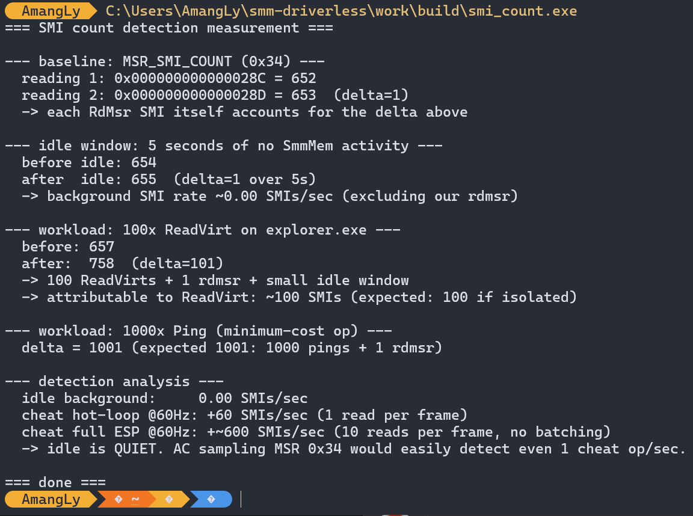

smm-driverless

read and write windows memory from usermode through smm. no kernel driver needed. just patch two modules into your bios, flash with q-flash plus, then talk to it from a normal exe.

works on my gigabyte b660 gaming x ddr4 with i5-12400F on bios f35a. other boards probably need different module guids.

forked from vtilo's smmmem release on unknowncheats. added rdmsr and wrmsr commands on top so we can read msr 0x34 and see how loud this thing is to anticheat. spoiler: very loud on this board, idle smi rate is basically zero so every call shows up.

source is in release-b660/src. build it from x64 vs developer cmd with build.cmd. then use uefireplace to swap usbrtsmm and httpbootdxe in your stock bios, rename to gigabyte.bin, flash with the rear q-flash plus button. dont use the menu q-flash, it rejects unsigned.

## Proof

